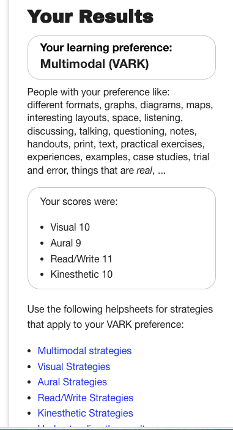
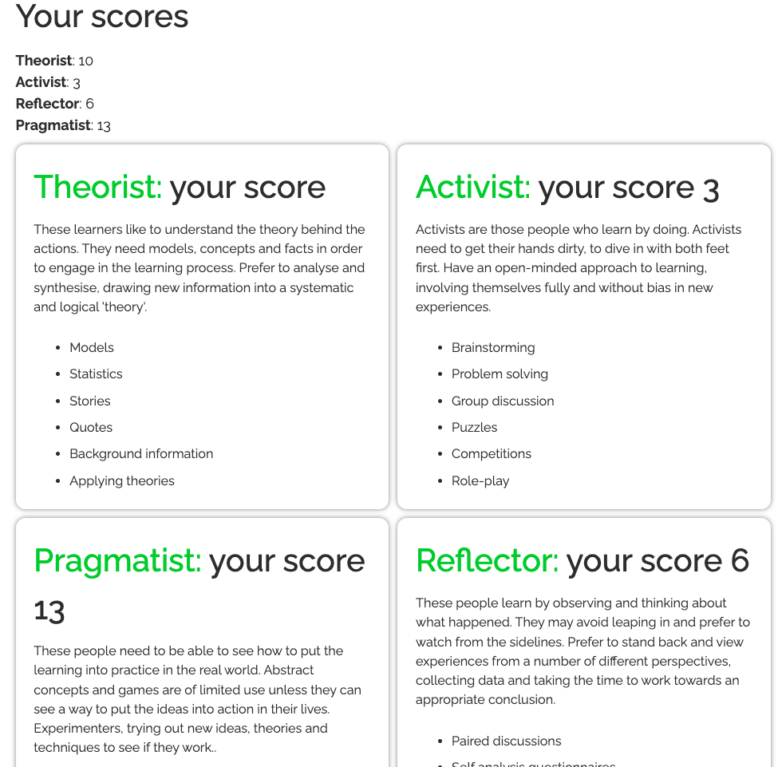
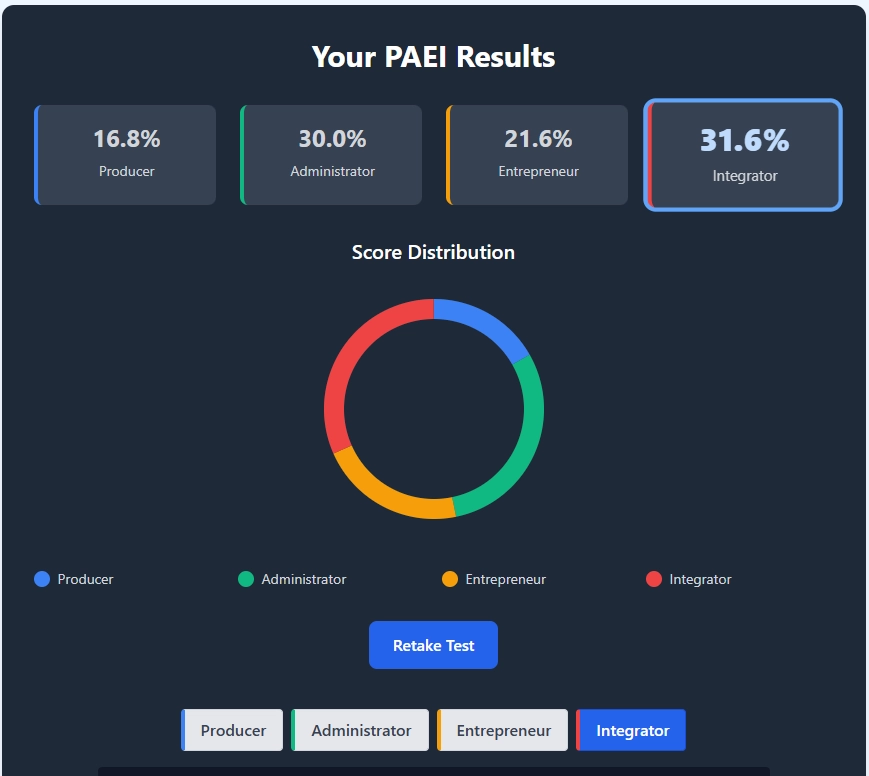
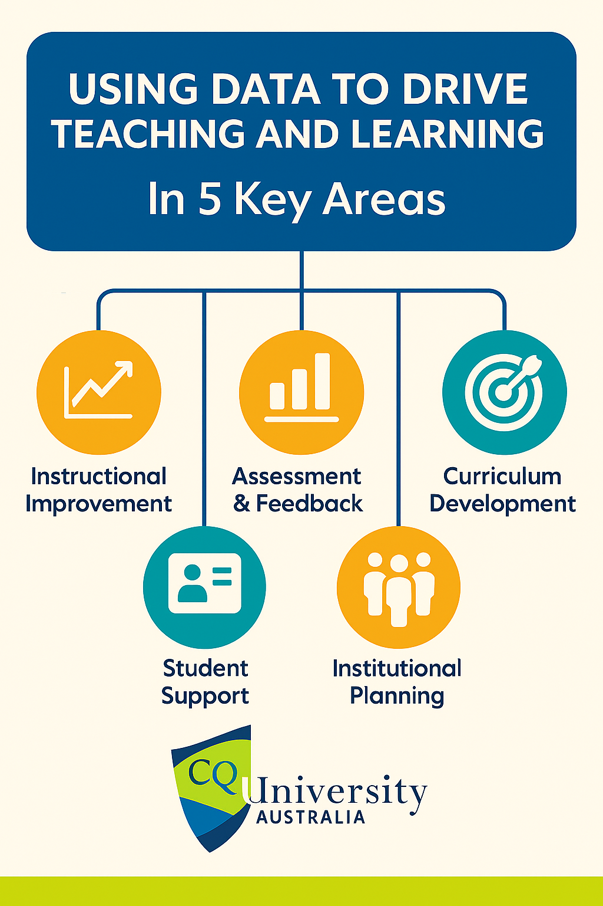
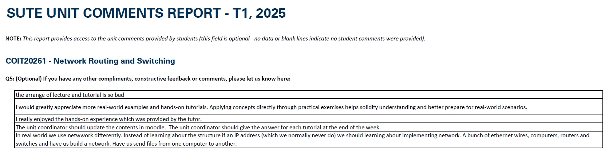
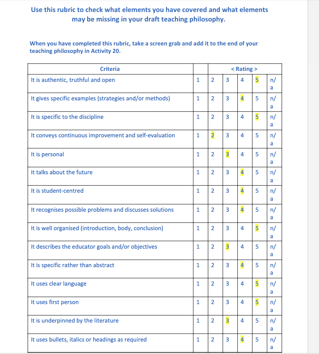

# OLTC20005-2025T2
## Activity 1
In my role as an ICT lecturer and working in the field of network and cybersecurity, adult learning is essential because the field changes rapidly and industry expectations shift constantly. Many of my students are adult learners on different campuses returning to study to up skill, change careers, or gain certification alongside work and family commitments. Adult learning principles help me design teaching that is practical, flexible, and clearly connected to real workplace tasks—such as configuring secure networks, responding to incidents, or applying risk controls. As a discipline lead, adult learning is also valuable for staff development: it supports consistent teaching standards, encourages reflective practice, and helps the team stay current with emerging threats, tools, and compliance requirements. When adult learning is embedded well, it strengthens student engagement, improves job readiness, and builds a culture of continuous improvement across the discipline.

## Activity 2
Anthony Jack raises a couple of issues that I really relate to in my teaching. One is that getting students in the door isn’t the same as helping them feel included. A lot of students don’t automatically know the “unwritten rules” of study—how to use feedback, what tutors expect, when to ask for help, or even what “good academic work” looks like. That gap can hit harder for first-in-family students or people returning to study later in life, which links to what we see in learner diversity across classes. 

The second issue is how universities can accidentally reward the students who already know the system, and leave others playing catch-up. In my ICT networking/cybersecurity classes, I see this when some students confidently join study groups and ask questions early, while others stay quiet until assessment time. What I want to change is making expectations more obvious (samples, checklists, short “how to succeed” guides), building low-pressure peer support, and checking in early so students don’t fall behind.

## Activity 3

Respecting First Nations protocols and language matters because words carry power: they can either recognise Aboriginal and Torres Strait Islander peoples as distinct, living cultures with continuing connection to Country, or they can unintentionally erase, stereotype, or “other” them. Using correct, capitalised terms (e.g., Aboriginal, Torres Strait Islander, Country) and avoiding outdated labels or acronyms helps communicate respect and accuracy, especially in higher education where students take cues from the language we normalise. AIATSIS notes that “Indigenous” can feel overly generic for some people and emphasises respectful naming and capitalisation. The Australian Government Style Manual also stresses using “Indigenous” carefully and clearly when writing generally, rather than as a vague catch-all.

In my educator role, I can manage this by explicitly teaching and modelling preferred terminology, embedding a short language glossary in assessment instructions, and checking local preferences when content relates to specific Nations or communities. I’ll also open classes and events with an Acknowledgement of Country (and only arrange a Welcome to Country through Traditional Owners), reinforcing why these practices matter in professional settings. Finally, I will use strengths-based, non-deficit language and correct issues promptly and respectfully when they arise in student discussions.

Some practices we already have are listed below: 
1. At the begining of first lecture online Zoom class, we acknowledge the country withe "The School of Engineering and Technology respectfully acknowledges the traditional owners of the lands on which we teach, learn, research, and undertake service and engagement. We pay our respects to the First Nations People and their elders past, present and future."
2. To integrated the Indigenous knowledge in a networking unit: "In this multi-cultural society, we would like to emphasise the traditional or local knowledge and acknowledge the country. As the quote "While exploring difference, never lose sight of sameness for it is the sameness that brings us together. – by John Briggs" indicates, communication networks also make us get together to learn the knowledge of network Infrastructure in this Unit. "
3. Extra slides to introduce the Indigenisation of ICT Curriculum. See more details in the unit COIT11238 Networked Infrastructure Foundations (HT1, 2025)

## Activity 4 
Inclusion breaks inclusion down into three simple areas based on the provided paper:

**Creating inclusive cultures** – This is the “vibe” of the place. Do people feel they belong? Are differences (culture, ability, language, identity) seen as normal and valuable? It’s about building a community where respect and teamwork are the default. 

**Producing inclusive policies** – These are the “rules of the game.” Policies should actively remove barriers, not quietly create them. That includes enrolment, behaviour, assessment, support services, and how decisions get made so everyone gets fair access. 

**Evolving inclusive practices** – This is what happens day-to-day in classrooms. Teaching, activities, and assessment are adjusted so all learners can participate and succeed, not just the “standard” student. It’s inclusion in action. 

## Activity 5 

| Criteria                                                     | Constructivism                                                                                                                                                                                                                                                                             | Connectivism                                                                                                                                                                                                                                                                                                                 |
| ------------------------------------------------------------ | ------------------------------------------------------------------------------------------------------------------------------------------------------------------------------------------------------------------------------------------------------------------------------------------ | ---------------------------------------------------------------------------------------------------------------------------------------------------------------------------------------------------------------------------------------------------------------------------------------------------------------------------- |
| **Similarities**                                             | Both view learning as **active** and built through engagement, not passive reception of content. Learners develop understanding through **doing**, exploring, and reflecting.                                                                                                              | Same: learning is **learner-centred**, active, and strengthened by interaction (with tasks, people, or tools) rather than only listening/reading.                                                                                                                                                                            |
| **Differences**                                              | Emphasises learners **constructing meaning from experience** (hands-on tasks, problem-based learning). Knowledge develops through **reflection** and scaffolding in a learning environment.                                                                                                | Emphasises learning through **networks** (people, digital platforms, communities, tools). Highlights “**knowing where to find**” and updating knowledge in rapidly changing fields.                                                                                                                                          |
| **How could use it in my teaching / past experiences** | Use **authentic lab scenarios** in networking/cybersecurity: troubleshooting misconfigurations, building secure network designs, incident response simulations, or analysing logs. Students learn through **trial, error, and reflection** (e.g., explaining why a control worked/failed). | Build **connected learning** by using live industry sources: CVE databases, vendor advisories, threat intel feeds, GitHub tools, professional forums, and communities. Activities can include **weekly threat briefings**, source evaluation tasks, collaborative resource curation, and sharing solutions in peer networks. |

## Activity 6
In my networking and cybersecurity classes, I use experiential learning by getting students to do real tasks first—like troubleshooting a broken network, analysing a packet capture, or responding to a fake security alert. After that, we pause and reflect: what did you notice, what worked, what didn’t, and why? Then we link it to the theory (routing, DNS, MITRE, least privilege) and try again with a new twist. With constructionism, students learn by building stuff: a secure network design, a small lab, firewall rules, or a simple SIEM dashboard—then they explain and defend their choices.

## Activity 7
| Knowles’ 5 assumptions (adult learning) | **Pedagogy (child/teacher-led)**                                                                                                 | **Andragogy (adult/learner-led)**                                                                                                                        |
| --------------------------------------- | -------------------------------------------------------------------------------------------------------------------------------- | -------------------------------------------------------------------------------------------------------------------------------------------------------- |
| **1) Self-concept**                     | Learners rely on the teacher to set goals, choose content, and direct learning (“Do this because I said so / it’s on the test”). | Learners want control and choice. They prefer to plan learning with us as educators, have options, and take responsibility for progress.                             |
| **2) Experience**                       | Learners have limited experience to draw on, so teaching often starts from scratch and uses examples chosen by the teacher.      | Learners bring lots of work/life experience. Teaching taps into what they already know, uses peer sharing, and treats experience as a learning resource. |
| **3) Readiness to learn**               | Readiness is linked to age/grade level and external requirements (move to the next unit/year; pass assessments).                 | Readiness is linked to real-life needs and role demands (new job tasks, workplace problems, “I need this now”).                                          |
| **4) Orientation to learning**          | Subject-centred: learn topics in a sequence (content first, application later).                                                  | Problem-centred: learn through solving authentic tasks (application first, theory when needed).                                                          |
| **5) Motivation**                       | Motivation is often external (grades, rewards, parent/teacher approval, avoiding failure).                                       | Motivation is mostly internal (career growth, confidence, job satisfaction, quality of life, personal goals).                                            |

Tasks 2: https://moodle.cqu.edu.au/mod/forum/discuss.php?d=1095032#p2205210

## Activity 8
Mezirow’s transformative learning explains how adults don’t just gain new info—they can actually change how they think. His big contribution is the idea that learning can shift a person’s “frame of reference” when they question assumptions and rethink beliefs after a challenging experience.

 In **networking** and **cybersecurity**, this fits well with ethics, risk thinking, and real breach case studies that push students past “tool-only” thinking and into deeper judgement and responsibility.

Gardner’s multiple intelligences challenges the idea that learners have one standard way of being “smart.” His contribution is recognising different strengths and ways of processing, so teaching should offer varied entry points and assessments.

 In my classes, I can mix diagrams, labs, simulations, short videos, and written incident reports, and let students demonstrate the same outcomes in different formats.

Wenger’s social learning (communities of practice) argues learning is mainly social—people learn by participating in shared practice, not just absorbing content.

 This fits perfectly with cyber teamwork: run “SOC-style” group tasks, rotating roles, shared tools, peer review, and debriefs so students learn the culture and habits of real professionals.

 ## Activity 9 
 After reading both articles, my feeling on new was realising how social learning is at a brain level. I always knew relationships matter in teaching, but I didn’t fully get that the brain actually learns better when it feels safe, connected, and supported. The Berkeley article made it clear that humans are wired to learn through other humans, and that a positive teacher–student relationship can change how well students focus, cope with stress, and take risks with learning.

From the neuroplasticity reading, what I didn’t really know is that learning is basically the brain rewiring itself through experience—and that this rewiring is influenced by emotion, movement, and interaction, not just “thinking hard.” The idea that the brain has priorities (like body/senses first, then emotions, then social stuff, then deep thinking) was interesting too. It explains why students shut down when they’re anxious or overwhelmed: their brain is busy protecting them, not analysing content.

In my networking and cybersecurity classes, this pushes me to build more supportive group problem-solving (like troubleshooting labs in pairs) and create a low-shame vibe where mistakes are normal, because that’s where real learning and brain growth happens.

## Activity 10

My VARK results show I’m a multimodal learner, so I naturally teach in mixed ways too. In networking and cybersecurity, this fits well because students need diagrams (topologies, threat models), explanations and discussion (troubleshooting thinking), written steps (lab guides, checklists), and hands-on practice (configs, Wireshark, SIEM queries). I don’t think I need a big change, but I do need to be more intentional. I should make sure lessons aren’t built only around how I learn, but include options for students who prefer quieter reflection or more structure.

## Activity 11

With Pragmatist (13) and Theorist (10), my teaching style naturally goes: explain the “why” clearly, then show how it works in the real world. That suits networking and cybersecurity because students want skills they can actually use on the job. I probably lean on structured content, models, and step-by-step problem solving more than “jump in and wing it.”

But my Activist score (3) is a reminder I might need to add more quick, hands-on moments—like timed troubleshooting, mini CTF challenges, or role-play incident response—so students practise making decisions under pressure.

I don’t think I need a total change, just a better balance to meet different learner needs.

## Activity 12 (posted)

One learning encounter that had a significant impact on me occurred while teaching networking and cybersecurity units. During a term, I noticed that several students were struggling to meaningfully engage with hands‑on lab activities, especially when relying on traditional, on‑campus network racks. Their feedback highlighted challenges such as limited access, inconsistent lab experiences across campuses, and difficulty visualising how the theory connected to real-world practice.

This experience prompted me to reflect deeply on the learning environment I was providing. I realised that even with well‑designed assessments and explanations, students needed more flexible, accessible, and scalable ways to practise. Their difficulties were not a lack of capability—it was a limitation in the learning design.

Changes I Made

As a result of this encounter, I made several changes (including building a networking environment with physical equipment/devices):

Shifted to cloud-supported practical learning. I introduced cloud-based solutions such as GNS3 simulation environments and remote-access networking labs so students could learn anytime and from any location.
Developed structured teamwork and project frameworks. To improve collaboration and engagement, I built a clearer teamwork model using MS Teams, GitHub, and Kanban boards, helping students organise and document their progress more effectively.
Redesigned assessments to better integrate practice and reflection. I added reflective components and task walkthroughs to help students explain their learning process, especially in the context of generative AI tools.
Impact on My Practice

This experience reinforced the importance of aligning teaching strategies with students’ real learning needs. It has guided many of my current initiatives, including improving cloud-based hands-on frameworks and continually updating unit designs to keep pace with modern networking and cybersecurity practice.

## Activity 13 (Posted in the forum)

A recent teaching encounter that influenced me occurred during a cloud‑based networking lab. Several students completed the technical steps correctly but were unsure how to balance using generative AI with demonstrating their own understanding. Their questions made me realise that students now need explicit guidance not only on practical skills but also on learning behaviours in an AI‑supported environment.

In response, I updated my teaching approach. I added clearer instructions on responsible AI use, outlining where it can assist and where independent reasoning is required. I strengthened the reflective components of assessments so students could explain their decisions, validate AI outputs, and articulate their learning process. I also refined the cloud lab guides to provide more structured scaffolding and reduce unnecessary frustration.

This experience reminded me that effective teaching must evolve with technology. Supporting students to apply AI responsibly is now integrated into how I design activities and assessments.

## Activity 14

The PAEI results (Integrator 31.6% and Administrator 30%) line up pretty closely with how I tend to teach. The Integrator side fits with me focusing on relationships, collaboration, and keeping the class feeling like a safe team space—especially important in networking/cyber where people can feel “behind” fast. The Administrator score also makes sense because I’m usually organised with plans, rubrics, step-by-step labs, and clear expectations (which students often need when concepts get technical). The lower Producer score is a good reminder though: I might not always push enough “ship it” momentum or fast delivery. A takeaway for my practice is to keep my structure and group vibe, but add more timed challenges, real incident-style tasks, and quicker checkpoints so students build urgency and confidence under pressure.

## Activity 15
After reviewing Biggs’ three levels of thinking about teaching, I see myself increasingly aligned with the third level—teaching as educating, where effectiveness is determined by what the student does. The first level, which focuses on the student’s innate ability, positions learning as the student’s responsibility alone, while the second level places emphasis on the teacher’s actions. Both perspectives are limited because they overlook the learner’s engagement in the process. In contrast, the third level highlights that genuine learning occurs when students actively participate, interact with tasks, and construct meaning from their experiences.

Biggs’ distinction between surface and deep learning reinforced this understanding. Surface learning occurs when students skim through tasks to meet outcomes, whereas deep learning emerges when they engage, question, and integrate new ideas with existing knowledge. This aligns with my goal of designing learning environments—through hands‑on activities and reflective components—that support deep engagement and constructive alignment.

## Activity 16

## Activity 17

Indicate in the figure that this data is from SUTE for the unit COIT20261 Switching and Routing, 2025 Term 1. 

**Reflection:** These comments suggest my students are very practical and want learning that feels like the real networking workplace. They’re asking for more hands-on tutorials, more real-world examples, and activities like building networks, connecting devices, and actually moving data between machines. That tells me my strongest teaching moments are when students get to do things, not just hear about concepts. At the same time, the feedback about the lecture/tutorial arrangement and Moodle updates hints that my weekly structure and online resources may not feel clear or consistent. I likely need tighter organisation, more labs, and quicker feedback.

## Activity 18
https://youtu.be/AuNuhOtY-1w

## Activity 19
**Teaching Philosophy: Networked Systems in computing science**

My teaching career started in Software Engineering College of Fuzhou University in 2008. From then on, my teaching philosophy has been formed gradually, and was strengthened during my PhD study which provided deeper knowledge computer science, and during two years distance and face-to-face teaching at CQUniversity.  I mainly teach undergraduate students in the area of networked systems. Due to this subject integrating several disciplines, such as mathematics, communication networks, cybernetics, even information security, it is not easy for students to build the networked systems fundamentals and further to apply or develop them in real-life. To tackle the difficulties for teaching these units, the core of my teaching philosophy has been formed around the following 5 key concepts.

- **Knowledge sharing**

Effectively sharing the knowledge of networked systems with students is an essential teaching process. My role as a lecturer is to enable my students to receive the knowledge of networked systems through well-organized teaching materials, including well-designed slides, clear guidelines, and short lecture videos (e.g. 5-10 minutes) with specific topics, which enable students to easily locate the needed content to enhance their understanding of the computer science. My goal is to effectively share the knowledge with students by detailed explanations of the basic concepts and theories, novel applications and practical exercises.  “Learning by doing” and “trial and error” (Race 2014) are adopted as my mainly teaching strategies to deliver the computing science knowledge to my students building their solid foundations of this subject.

- **Adequate discussion and interaction**

To enhance the students’ understanding of the knowledge they need to learn, adequate discussion and interaction are important parts in my teaching philosophy. For example, after introducing the important concept H∞ filtering, a hot topic such as how to achieve remote signal processing through communication networks is introduced to initiate discussion. In this active learning, I will lead the discussion and maintain the student’s interaction with five factors (Race 2014).  I also provide more attractive discussing topics how to deal with packets time delay and packet dropouts happened in communication networks. As part of this process, I normally organise such kind of debate in small groups and ask each student to show their wanting, needing and what they have done, and then I provide feedbacks to them and help them finally digest what they need to learn.

- **Effective communication**

Diversity should be considered in teaching many of my students from different countries with different cultures. Effective communication is a way to make me understand more about each student's personality, characteristics, and capacity, especially for the flex students. As Betts (2013) argues the importance to integrate effective communication in distance education, such effective way also facilitate the teaching course design and method selection, including using ICT tools, such as on email, video conference, and teamwork software.

- **Common collaboration**

Collaboration with colleagues helps me to keep with trends of computer science, improve my teaching skills and even update my teaching philosophy. I also encourage the students to collaboration through group assignments, such as on-line forum discussions, which will help students to improve their teamwork skills.

- **Continues inspiration**

Motivation is an important aspect of students’ involvement (Astin 1984). To inspire students’ interest and boost their passion to build their future career, I encourage students to investigate new topics for networked systems in the area of computing science. In my masters’ research on the scheduling and co-design for networked systems, I introduced an information dispatching middleware.  To integrate network chemical protocols, control strategies and intelligent methods for networked systems, I inspire my students to develop their own modules, such as the information selection module and network congestion module in a new framework. Under such continued inspiration, most students were satisfied and had good outcomes. This is a way to cultivate students’ creative thinking in my teaching philosophy.

In summary, my teaching philosophy can be summarised into sharing, collaboration and inspiration with effective communications. Based on this, my teaching strategies and methods are designed and adopted to achieve my teaching values, beliefs and goals in the fields of computing science. The positive driven factors, attitudes and beliefs (Richardson 1996), will stepwise refine my teaching philosophy for the high requirements of tertiary education.

**Reference:**

Astin, A.W., 1984. *Student involvement: A developmental theory for higher education*. Journal of college student personnel, 25(4), pp.297-308.

Betts, K., 2009. *Lost in translation: Importance of effective communication in online education*. Online Journal of Distance Learning Administration, 12(2), pp.1-14.

Race, P., 2014. *The lecturer's toolkit: a practical guide to assessment, learning and teaching*. Routledge.

Richardson, V., 1996. *The role of attitudes and beliefs in learning to teach*. Handbook of research on teacher education, 2, pp.102-119.

## Activity 20

Complete and submit the unit evaluation as requested. Thank you Julie, for a great learning experience. 